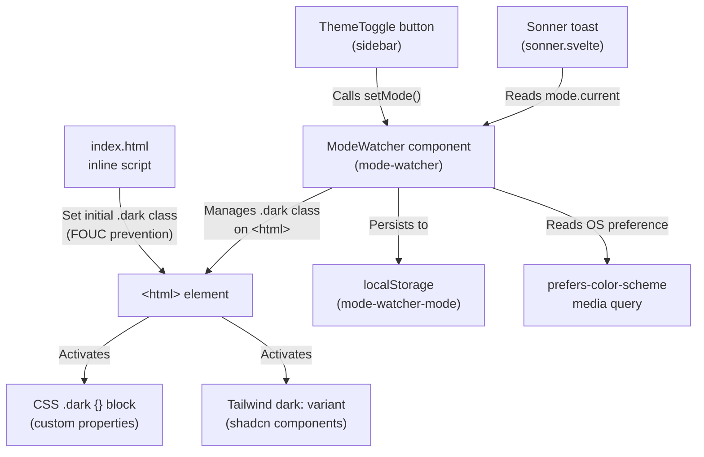
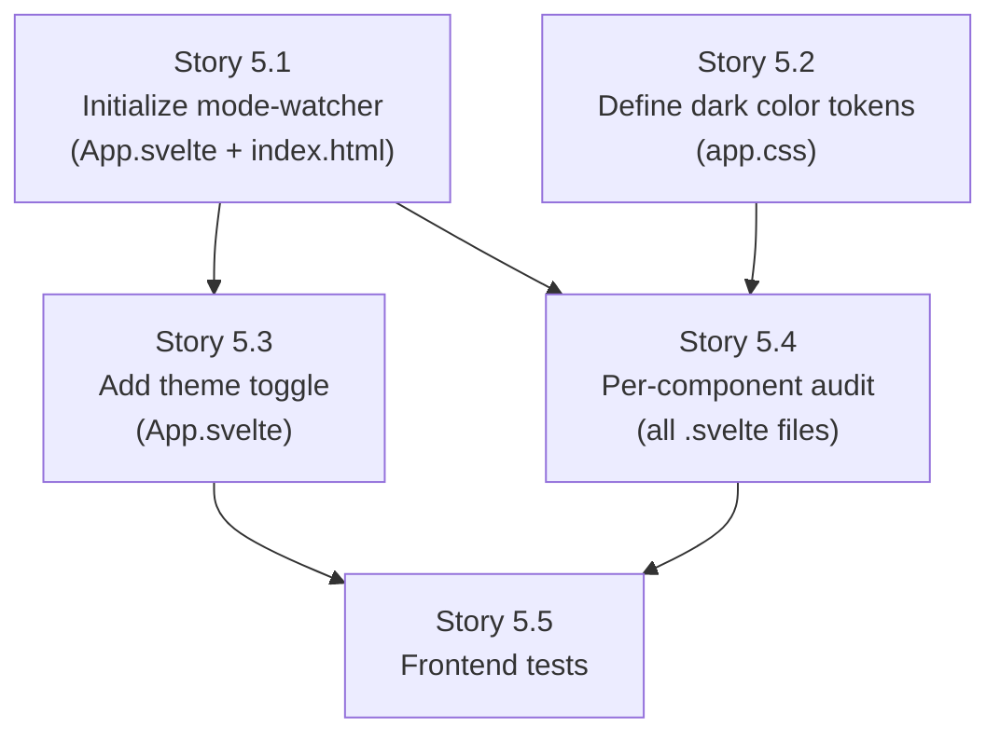

# Architecture: Dark Mode for MiniRouter Dashboard

## Introduction

This document defines the architectural approach for implementing dark mode in the MiniRouter frontend dashboard, as specified in [`docs/prd-dark-mode.md`](file:///Users/fanioz/code/dotnet/minirouter/docs/prd-dark-mode.md).

**Relationship to Existing Architecture:**
This is a frontend-only enhancement. No backend changes are required. The implementation leverages two dependencies already installed but not wired: `mode-watcher` (v1.1.0) and Tailwind CSS v4's `dark:` variant.

### Change Log

| Date       | Version | Description                        | Author              |
|------------|---------|------------------------------------|----------------------|
| 2026-08-12 | 1.0     | Initial Architecture               | Aria (@architect)    |

---

## Enhancement Scope and Integration Strategy

### Enhancement Overview
- **Type:** Frontend UI Enhancement
- **Scope:** Theme infrastructure, color tokens, toggle control, per-component audit
- **Integration Impact:** Minimal — CSS changes + 1 new Svelte component mount + sidebar toggle
- **Backend Impact:** None

### Key Architectural Decision: CSS-Only Theme Layer

The dark mode implementation uses a **CSS variable swap** strategy, not JavaScript-driven style changes. This means:

1. **`mode-watcher`** manages `<html class="dark">` — it handles localStorage persistence, OS preference detection, and FOUC prevention.
2. **CSS custom properties** in `app.css` flip values under `.dark` selector.
3. **Tailwind v4's `dark:` variant** (already used by shadcn-svelte components) activates automatically when `.dark` class is present.
4. **Zero runtime cost** — all theming is resolved at the CSS level.

---

## Tech Stack Alignment

### Existing Dependencies (Already Installed — No Changes)

| Dependency          | Version | Role in Dark Mode                            |
|---------------------|---------|----------------------------------------------|
| `tailwindcss`       | 4.3.3   | `dark:` variant + semantic color tokens      |
| `@tailwindcss/vite` | 4.3.3   | Vite plugin for TW4 compilation              |
| `mode-watcher`      | 1.1.0   | Theme state management, localStorage, FOUC   |
| `@lucide/svelte`    | 1.30.0  | Sun/Moon/Monitor icons for toggle            |

### New Dependencies
**None.** All required packages are already in `package.json`.

---

## Component Architecture

### Theme System Flow



### Component Changes

#### 1. `App.svelte` — Mount `ModeWatcher` + Add Toggle

**Current state:** No theme infrastructure.

**Changes:**
- Import and mount `<ModeWatcher>` from `mode-watcher` at root level
- Add theme toggle button at the bottom of the sidebar nav
- Use `setMode()` to cycle: system → light → dark → system
- Use `mode` store to display the correct icon (Sun / Moon / Monitor)

```svelte
<!-- In App.svelte, add at component top-level -->
<script>
  import { ModeWatcher, setMode, mode } from 'mode-watcher';
  import { Sun, Moon, Monitor } from '@lucide/svelte';
  // ... existing imports
</script>

<ModeWatcher />
<!-- rest of template -->
```

**Toggle placement:** Bottom of `<nav>` in sidebar, styled consistently with existing nav items. When collapsed, shows icon only.

#### 2. `index.html` — FOUC Prevention Script

**Current state:** No theme initialization.

**Changes:** Add an inline `<script>` in `<head>` (before CSS loads) that reads `localStorage` and sets the `.dark` class immediately, before the browser paints.

```html
<script>
  (function() {
    var mode = localStorage.getItem('mode-watcher-mode');
    if (mode === '"dark"' || 
        (!mode && window.matchMedia('(prefers-color-scheme: dark)').matches)) {
      document.documentElement.classList.add('dark');
    }
  })();
</script>
```

> **Rationale:** `mode-watcher` adds the class once Svelte hydrates, but there's a brief window between first paint and hydration where the wrong theme could flash. This inline script closes that gap.

#### 3. `app.css` — Dark Theme Token Definitions

**Current state:** Light-only `:root` variables + hardcoded hex values.

**Architecture decision: Two-layer token system.**

| Layer | Purpose | Mechanism |
|-------|---------|-----------|
| **Layer 1: Legacy custom properties** | Used by `.sidebar`, `.nav-item`, `.modal-content`, `.btn-ghost`, `.input-field`, `.toast` | `:root` + `.dark` CSS blocks |
| **Layer 2: shadcn-svelte Tailwind tokens** | Used by `bg-background`, `text-foreground`, `bg-card`, `bg-muted`, `bg-primary`, etc. | Tailwind v4 `@theme` inline definitions in `app.css` |

Both layers must be defined. The shadcn-svelte components (card, button, badge, input, switch, dialog, table, checkbox) use Tailwind semantic tokens. The legacy class-based styles use the `:root` custom properties.

**CSS Structure:**

```css
@import "tailwindcss";

/* ========================================
   Layer 1: Legacy custom properties
   ======================================== */
:root {
  --bg-color: #f9fafb;
  --panel-bg: #ffffff;
  --text-primary: #111827;
  --text-secondary: #4b5563;
  --border-color: #e5e7eb;
  --primary: #2563eb;
  --primary-hover: #1d4ed8;
  --danger: #dc2626;
  --danger-hover: #b91c1c;
  --success: #16a34a;
  --radius: 6px;
  --hover-bg: #f3f4f6;
  --active-bg: #eff6ff;
}

.dark {
  --bg-color: #09090b;
  --panel-bg: #0a0a0b;
  --text-primary: #fafafa;
  --text-secondary: #a1a1aa;
  --border-color: #27272a;
  --primary: #3b82f6;
  --primary-hover: #60a5fa;
  --danger: #ef4444;
  --danger-hover: #f87171;
  --success: #22c55e;
  --hover-bg: #27272a;
  --active-bg: #1e3a5f;
}

/* ========================================
   Layer 2: shadcn-svelte / Tailwind v4 tokens
   ======================================== */
@theme inline {
  --color-background: var(--bg-color);
  --color-foreground: var(--text-primary);
  --color-card: var(--panel-bg);
  --color-card-foreground: var(--text-primary);
  --color-popover: var(--panel-bg);
  --color-popover-foreground: var(--text-primary);
  --color-primary: var(--primary);
  --color-primary-foreground: #ffffff;
  --color-muted: var(--hover-bg);
  --color-muted-foreground: var(--text-secondary);
  --color-accent: var(--hover-bg);
  --color-accent-foreground: var(--text-primary);
  --color-destructive: var(--danger);
  --color-border: var(--border-color);
  --color-input: var(--border-color);
  --color-ring: var(--primary);
}
```

> **Key insight:** By mapping Tailwind's `@theme` tokens to the Layer 1 CSS variables (which flip in `.dark`), we get automatic dark mode in shadcn components **without touching any component files**. The `dark:` prefixed classes in components provide additional refinement.

**Dark-mode overrides for `--color-primary-foreground`:**

```css
.dark {
  /* Primary foreground needs to be dark on the lighter blue button */
  --color-primary-foreground: #0a0a0b;
}
```

Wait — actually, with `--primary: #3b82f6` in dark mode, white text still works for contrast. Let me verify:
- `#3b82f6` (blue) vs `#ffffff` (white) → contrast ratio ~4.7:1 ✅ AA pass.
- Keep `--color-primary-foreground: #ffffff` for both modes.

#### 4. Per-Component Dark Mode Hardcoded Color Fixes

The following hardcoded light-only colors in `app.css` need to reference variables:

| Selector | Current Value | Fix |
|----------|--------------|-----|
| `.btn-ghost:hover` | `#f3f4f6` | `var(--hover-bg)` |
| `.btn-toggle:hover` | `#f3f4f6` | `var(--hover-bg)` |
| `.nav-item:hover` | `#f3f4f6` | `var(--hover-bg)` |
| `.nav-item.active` | `#eff6ff` | `var(--active-bg)` |
| `.input-field:disabled` | `#f3f4f6` | `var(--hover-bg)` |

These are all in [`app.css`](file:///Users/fanioz/code/dotnet/minirouter/frontend/src/app.css) and can be fixed by referencing the new `--hover-bg` and `--active-bg` variables.

#### 5. Svelte Component Audit

Most Svelte components use **Tailwind semantic classes** (`bg-background`, `text-foreground`, `bg-card`, `bg-muted`, `text-muted-foreground`, `bg-primary`, `text-primary-foreground`, `border`, `bg-destructive`) which will work automatically once `@theme` tokens are defined.

**Components requiring attention:**

| Component | Issue | Fix |
|-----------|-------|-----|
| `App.svelte` | Uses Tailwind tokens — should work automatically | Verify only |
| `Home.svelte` | Uses Tailwind tokens — should work automatically | Verify only |
| `Providers.svelte` | Uses Tailwind tokens — should work automatically | Verify only |
| `Models.svelte` | Uses Tailwind tokens — should work automatically | Verify only |
| `Logs.svelte` | `<select>` elements use inline `bg-background` class — OK. Hardcoded `bg-green-500/10` for success badge needs no fix (works on both themes). | Verify only |
| `Analytics.svelte` | Uses `text-blue-500`, `text-green-500` — these are Tailwind built-ins, fine in dark mode | Verify only |
| `ApiKey.svelte` | Already has `dark:` classes (`dark:bg-green-950/20`, `dark:text-green-300`, etc.) — will activate once `.dark` class is present | Verify only |
| `Playground.svelte` | Uses `bg-background`, `bg-muted`, `text-primary`, `bg-primary` — fine. | Verify only |

**Expected result:** Zero or minimal component file changes needed. The CSS-variable strategy handles everything at the token level.

---

## Source Tree — Changed Files

```text
frontend/
├── index.html                    # MODIFIED — FOUC prevention script
├── src/
│   ├── app.css                   # MODIFIED — .dark block + @theme tokens + var() fixes
│   └── App.svelte                # MODIFIED — ModeWatcher mount + theme toggle
└── (all other .svelte files)     # VERIFY ONLY — no changes expected
```

---

## Implementation Plan

### Story Execution Order (with Dependencies)



**Parallelizable:** Stories 5.1 and 5.2 have no dependencies on each other and can be implemented simultaneously. Story 5.3 depends on 5.1. Story 5.4 depends on both 5.1 and 5.2. Story 5.5 depends on 5.3 and 5.4.

**Recommended execution:** Implement 5.1 + 5.2 together (they touch different files), then 5.3, then 5.4, then 5.5.

### Estimated Effort

| Story | Complexity | Est. Time |
|-------|-----------|-----------|
| 5.1   | Low       | 15 min    |
| 5.2   | Medium    | 30 min    |
| 5.3   | Low       | 20 min    |
| 5.4   | Low       | 20 min    |
| 5.5   | Low       | 15 min    |
| **Total** | | **~1.5 hr** |

---

## Testing Strategy

### Automated Tests
- **Vitest:** Test that theme toggle button renders, clicking it calls `setMode()`.
- **Existing tests:** Must continue to pass (`cd frontend && npm test`).

### Manual Verification Checklist
- [ ] Light mode: identical to current appearance (no regression)
- [ ] Dark mode: all 7 pages render with correct dark palette
- [ ] System mode: follows OS `prefers-color-scheme`
- [ ] Toggle cycles: system → light → dark → system
- [ ] Persistence: refresh page, theme persists
- [ ] FOUC: no flash of wrong theme on page load
- [ ] Sidebar collapsed: toggle icon-only mode works
- [ ] Toast notifications: adapt to current theme
- [ ] Modals/dialogs: correct background in dark mode
- [ ] Form inputs: borders and backgrounds correct in both modes
- [ ] WCAG AA: text contrast ≥ 4.5:1 in dark mode

---

## Security & Performance Impact

- **Security:** No impact — frontend-only CSS changes.
- **Performance:** No runtime cost — CSS variable swap is instant.
- **Bundle size:** Estimated < 500 bytes additional CSS (variable definitions). `ModeWatcher` component is already in the bundle via `mode-watcher` import in `sonner.svelte`.
- **Backend:** No changes — Native AOT build unaffected.

---

## Risks and Mitigations

| Risk | Likelihood | Impact | Mitigation |
|------|-----------|--------|------------|
| FOUC on slow connections | Low | Medium | Inline `<script>` in `<head>` sets class before paint |
| shadcn token mismatch | Low | High | Verify all `--color-*` tokens used by components are defined |
| Contrast ratio failures | Medium | Medium | Test all text/background combinations against WCAG AA |
| Legacy `.sidebar`/`.nav-item` styles conflict | Low | Low | Variables reference the same source — no conflict possible |

---

## Next Steps

### Developer Handoff
Activate `@dev` and implement the dark mode feature following the story order defined above. Start by reviewing [`docs/prd-dark-mode.md`](file:///Users/fanioz/code/dotnet/minirouter/docs/prd-dark-mode.md) and this architecture document. The implementation is CSS-heavy with minimal component changes — focus on getting the `@theme inline` + `.dark` CSS variables right first, then wire `mode-watcher`.

— Aria, arquitetando o futuro 🏗️
