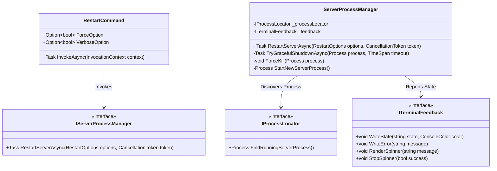
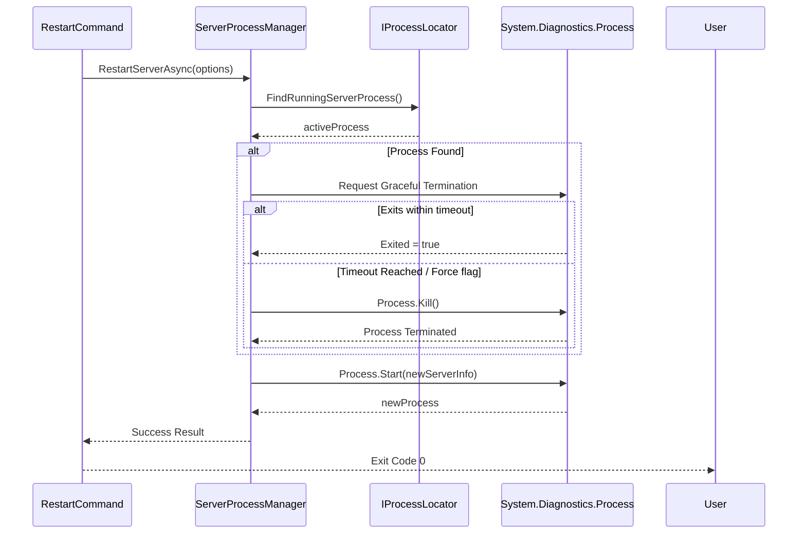

# CLI Restart Command Technical Architecture

## 1. System Overview

This architecture defines the components required to implement a robust server restart command within the .NET CLI environment. The design prioritizes graceful termination, deterministic process lifecycle management, and clear terminal feedback, avoiding complex external dependencies by leveraging the native `System.Diagnostics.Process` APIs.

## 2. Component Design

The architecture is divided into three primary layers:
1. **Command Layer:** Handles CLI argument parsing and invocation.
2. **Process Management Layer:** Orchestrates the lifecycle of the server process.
3. **UX / Feedback Layer:** Manages terminal output and state transitions.

## 3. Class Responsibilities

### `RestartCommand` (Command Layer)
- **Framework:** Inherits from `System.CommandLine.Command`.
- **Role:** Entry point for the `restart server` command.
- **Responsibilities:**
  - Define and parse CLI arguments (`--force`, `--verbose`).
  - Resolve dependencies (DI) for process management.
  - Handle overarching cancellation (Ctrl+C).
  - Return the final exit code (`0` for success, non-zero for failure).

### `ServerProcessManager` (Process Management Layer)
- **Role:** The core orchestration engine.
- **Responsibilities:**
  - Coordinates the 4-step restart lifecycle defined in the PRD (Find -> Drain -> Kill -> Start).
  - **Graceful Shutdown:** Sends a graceful termination request (e.g., via IPC, named pipes, or `CloseMainWindow()` if applicable, depending on the server's listening mechanism).
  - **Fallback:** Issues a hard `Process.Kill(entireProcessTree: true)` if the graceful shutdown times out or if `--force` is provided.
  - **Startup:** Uses `Process.Start()` with `ProcessStartInfo` to spawn the new instance.

### `IProcessLocator` (Process Management Layer)
- **Role:** Abstracts the logic of finding the current server process.
- **Implementation Details:** 
  - Searches by Process Name (`Process.GetProcessesByName("MiniRouter.Server")`).
  - Or reads a `.pid` file stored in a known `.aiox/` or `.tmp/` local directory.

### `ITerminalFeedback` (UX Layer)
- **Role:** Isolates `System.Console` calls to keep the process logic unit-testable.
- **Responsibilities:** 
  - Outputs color-coded state changes as requested in Story 1.3.
  - Abstracts spinner logic so it doesn't pollute the core orchestration code.

## 4. Sequence Diagram: Restart Lifecycle

## 5. Key Technical Decisions & Trade-offs

1. **Dependency Injection:** Injecting `IProcessLocator` and `ITerminalFeedback` ensures the complex `ServerProcessManager` can be thoroughly unit tested without spawning actual OS processes or polluting the console.
2. **Graceful Shutdown Mechanism:** `System.Diagnostics.Process` lacks a native POSIX `SIGTERM` on Windows. For true graceful shutdown on all platforms, the server must either support `CloseMainWindow()` or the CLI must signal the server via a named pipe/HTTP endpoint before falling back to `Kill()`.
3. **Exit Codes:** The CLI will pass OS-level exit codes through to the shell, aligning with NFR3 for CI/CD compatibility.
