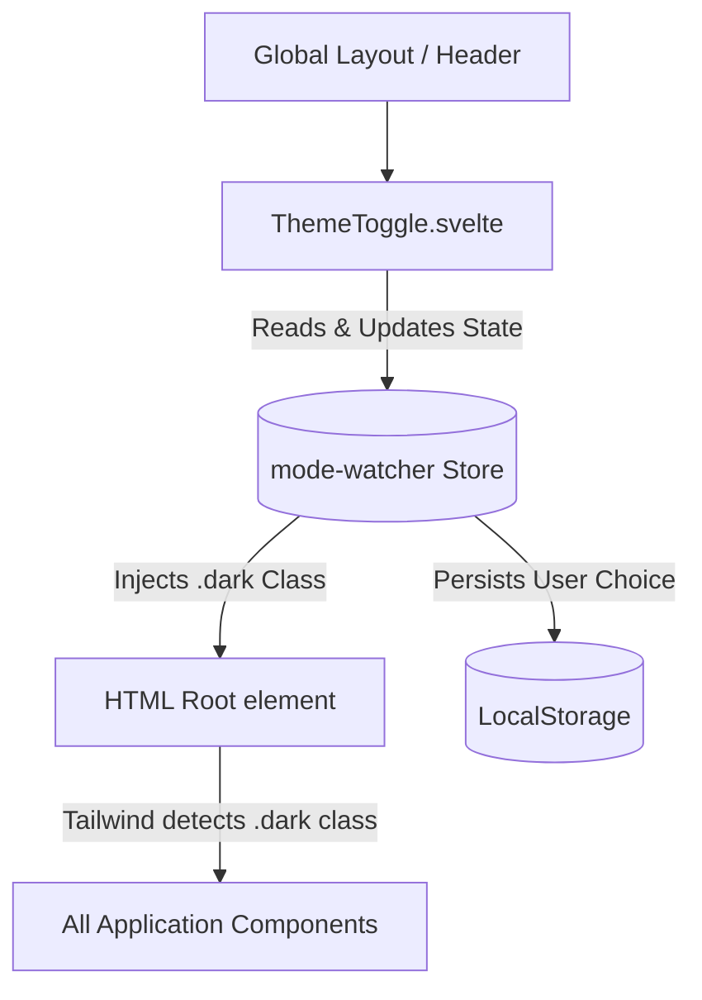

# MininRouter Brownfield Enhancement Architecture

## 1. Introduction
This document outlines the architectural approach for enhancing MininRouter with a Futuristic Dark Mode UI Overhaul. Its primary goal is to serve as the guiding architectural blueprint for AI-driven development while ensuring seamless integration with the existing system.

**Relationship to Existing Architecture:**
This document supplements the existing project architecture (detailed in `docs/brownfield-architecture.md`) by defining how the new CSS tokens, theme persistence, and Tailwind configuration will integrate with the current Svelte 5 application.

### Existing Project Analysis
**Current Project State**
- **Primary Purpose:** A smart proxy and router for LLM API providers, managed via a built-in administrative dashboard.
- **Current Tech Stack:** Svelte 5 (Vite), Tailwind CSS 4.3.3, `bits-ui`, and `lucide-svelte`.
- **Architecture Style:** Monolithic repository where the frontend is an SPA compiled and served from `wwwroot/` by a .NET Minimal API backend.
- **Deployment Method:** A single compiled binary (Native AOT) with embedded SQLite and frontend assets.

**Identified Constraints**
- **Native AOT strictness:** Any new backend APIs would require explicit JSON context registration. This epic is restricted strictly to the frontend.
- **Embedded Build Process:** The frontend must build cleanly and synchronously via `npm run build` within `MininRouter.csproj`.
- **Tailwind Scope:** Styling must rely on Tailwind utility classes and native CSS variables in `app.css`.

---

## 2. Enhancement Scope and Integration Strategy
**Enhancement Type:** Frontend UI/UX Refactoring & Theming
**Scope:** Strictly limited to the `frontend/` directory, focusing on Tailwind CSS configuration, `app.css` CSS variables, and Svelte component styling.
**Integration Impact:** Low (UI layer only). Zero impact on the SQLite database or Minimal APIs backend.

### Integration Approach
- **Code Integration Strategy:** We will utilize the existing `mode-watcher` library to manage theme state. We will modify `tailwind.config.js` and `src/app.css` to add the `.dark` class CSS variables. Existing components will have utility classes updated.
- **Database Integration:** None. Theme preference is persisted via LocalStorage.
- **API Integration:** None. Existing API contracts remain completely untouched.
- **UI Integration:** The Theme Toggle component will be integrated into the existing global layout shell.

### Compatibility Requirements
- **Existing API & Database Compatibility:** 100% backward compatible (no changes).
- **UI/UX Consistency:** Existing forms, modals, and tables built with `bits-ui` must retain their ARIA accessibility attributes.
- **Performance Impact:** Avoid heavy `backdrop-blur` on dense lists to maintain 60fps scrolling.

---

## 3. Tech Stack Alignment
No new technologies are being introduced.
- **Frontend Framework:** Svelte 5.x
- **Styling:** Tailwind CSS 4.x
- **UI Primitives:** `bits-ui` (Existing)
- **Icons:** `lucide-svelte` (Existing)
- **Theme Manager:** `mode-watcher` (Existing)

---

## 4. Data Models and Schema Changes
*(N/A — Explicitly Out of Scope)*
There are zero database changes, DTO modifications, or backend model updates required.

---

## 5. Component Architecture
### New Components
**`ThemeToggle.svelte`**
- **Responsibility:** Renders the interactive toggle button and communicates with `mode-watcher`.
- **Integration Points:** Placed inside the global navigation shell (e.g., `src/routes/+layout.svelte`).
- **Dependencies:** `lucide-svelte` (icons), `mode-watcher` (state management).

### Component Interaction Diagram


---

## 6. Source Tree Integration
### New File Organization
```text
minirouter/
├── frontend/
│   ├── src/
│   │   ├── app.css                   # Existing file - add CSS variables
│   │   ├── lib/
│   │   │   └── components/
│   │   │       └── ThemeToggle.svelte # NEW addition
│   │   └── routes/
│   │       └── +layout.svelte        # Existing file - inject ThemeToggle
│   └── tailwind.config.js            # Existing file - add color tokens
```

### Integration Guidelines
- **File Naming:** `ThemeToggle.svelte` uses PascalCase.
- **CSS Strategy:** All base tokens and global futuristic effects go strictly into `src/app.css`.

---

## 7. Infrastructure and Deployment Integration
- **Deployment Approach:** Standard existing process (`dotnet publish`).
- **Infrastructure Changes:** None.
- **Rollback Strategy:** Standard `git revert`. Rolling back guarantees an instant, 100% safe return to the previous visual state without data loss risk.

---

## 8. Coding Standards and Conventions
- **Tailwind Tokens:** All new colors must be defined as native CSS variables in `app.css` and mapped in `tailwind.config.js`.
- **Glow Effects:** Create reusable CSS classes in `app.css` (e.g., `.glow-primary`) rather than hardcoding complex drop-shadow hex values in HTML.
- **Existing API Compatibility:** Never modify JSON payloads sent from the frontend to the backend.

---

## 9. Testing Strategy
- **Unit Tests:** `frontend/src/lib/components/ThemeToggle.test.ts` (100% logic coverage for toggle state).
- **Integration Tests:** Ensure that modifying global CSS tokens does not break existing `bits-ui` Flexbox/Grid layouts.
- **Regression Tests:** Standard `npm test` and `dotnet test` must pass. Manual visual inspection of Providers List and Routing Logs required.

---

## 10. Security Integration
*(N/A — Explicitly Out of Scope)*
Theme preferences saved in LocalStorage do not contain sensitive data.

---

## 11. Next Steps
### Story Manager Handoff
**To SM:** The architecture is validated. The integration is strictly frontend (Svelte/Tailwind) relying on `mode-watcher` for state. The backend SQLite and APIs are untouched. Please create the first story focusing on configuring `tailwind.config.js` and `app.css` with the new theme tokens before building the `ThemeToggle.svelte` component.

### Developer Handoff
**To Dev:** Reference this architecture and `docs/front-end-spec.md`. Crucial constraints: DO NOT modify backend C# code or APIs to prevent Native AOT crashes. Keep all complex CSS glows inside `app.css` classes, not inline utility strings. Rely entirely on `mode-watcher` for theme persistence.
