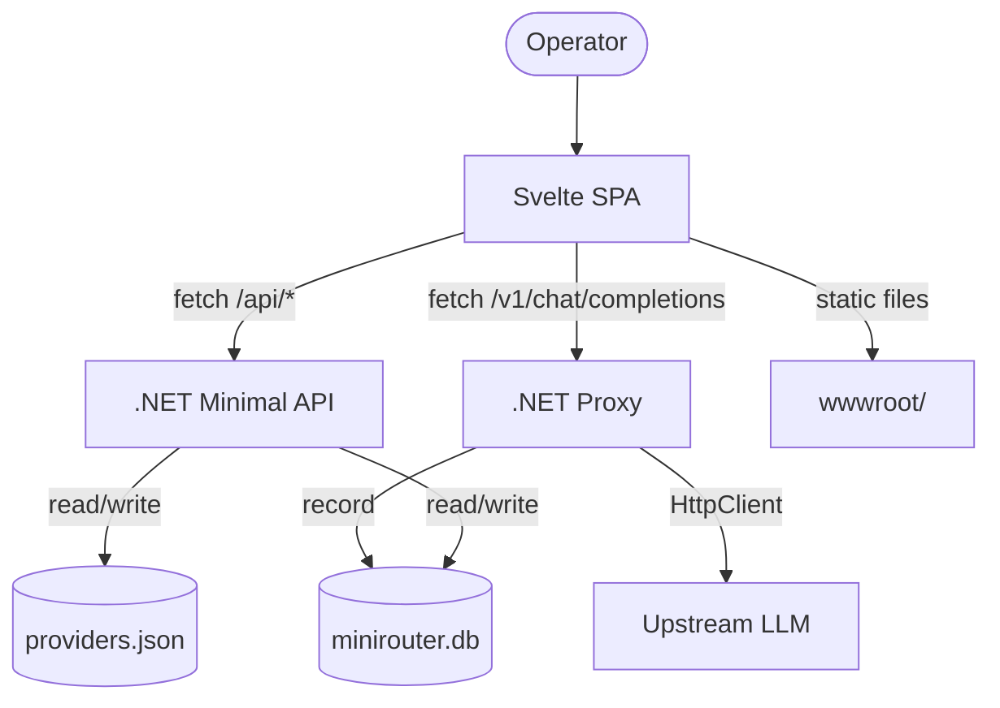

# Component Architecture

> **Note:** This file maps the actual Svelte frontend components used in the current SPA. It is the bridge between the backend service layer and the dashboard UI. The dashboard is built with Svelte 5 + Tailwind 4 + `bits-ui`; this document describes the **current** component structure, not a proposed one.

## Backend Service Layer (C#)

| Component | Interface / Class | Responsibility | Key State |
|-----------|------------------|----------------|-----------|
| `ProviderService` | `IProviderService` | CRUD on `providers.json`, round-robin per `(provider,model)`, circuit breaker per `(provider,model)` | `_providers`, `_modelIndices`, `_circuitStates` |
| `ApiKeyService` | `IApiKeyService` | SHA-256-hashed key creation + validation, `IMemoryCache` fast path, `LastUsedAt` upserts | `_cache` (memory), `minirouter.db` |
| `ProxyService` | `IProxyService` | Ingress dispatch, streaming forwarder, Anthropic↔OpenAI translation trigger, error classification + circuit recording, log emission | stateless |
| `LogService` | `ILogService` | SQLite log writes + analytics rollups | `minirouter.db` |
| `LogRetentionService` | `IHostedService` | Periodic pruning of old `request_log` rows | timer-driven |
| `ErrorClassifier` | static | `(status, body)` → `ErrorKind` + cooldown. Handles `Retry-After`, `resets_at`, exponential backoff math | none |
| `PricingTable` | static | Three-tier cost lookup: exact → pattern → default. Null when no match. | hardcoded rates |
| `PresetService` | `IPresetService` | Enable a preset (validate + create provider), list presets with `ConnectedCount`, suggest models per preset | `IMemoryCache` for filtered model lists |
| `PresetCatalog` | static | Hardcoded list of 4 providers (OpenCode Free, OpenRouter, DeepSeek, Groq) | none |
| `Translation.*Translator` | static | `JsonNode`-based wire format translation. Three classes: request, response, stream. | `AnthropicStreamState` per stream |
| `ApiKeyEndpointFilter` | `IEndpointFilter` | `Authorization: Bearer ...` extraction + validation, injects `ApiKeyId` into `HttpContext.Items` | none |

## CLI Layer

| Command | Spectre class | Mode |
|---------|--------------|------|
| `-m <model> [-p <prompt>]` | inline in `Program.cs` | One-shot completion to stdout (in-process host) |
| `restart` | `Cli.Commands.RestartCommand` | Locate server via `.minirouter.pid`, POST `/\_shutdown`, spawn fresh |
| `providers list` | `ProvidersListCommand` | `GET /api/providers`, print table |
| `providers add` | `ProvidersAddCommand` | Interactive `POST /api/providers` |
| `providers edit` | `ProvidersEditCommand` | Interactive `PUT /api/providers/{id}` |
| `providers delete` | `ProvidersDeleteCommand` | Interactive `DELETE /api/providers/{id}` |
| `status` | inline | `GET /health` |
| `list providers` | inline | `GET /api/providers` |
| `list models` | inline | `GET /models` |

## Frontend (Svelte SPA)

The SPA lives in `frontend/src/` and builds to `wwwroot/`. The exact route structure may evolve — refer to `frontend/src/routes/` for the current set. The architecture below describes the **responsibilities**, not the file names.

### Design system

The dashboard's visual language is governed by the **MiniRouter Neutral Modern** design system at [`docs/frontend/design/`](../../frontend/design/README.md). When implementing or reviewing a surface:

- **Tokens** live in [`colors_and_type.css`](../../frontend/design/colors_and_type.css) — `:root` for light, `html.dark` for dark. Single accent (`#E56A4A` coral), Inter-only type, JetBrains Mono for numerals.
- **Component classes** (`.btn`, `.card`, `.kpi`, `.badge`, `.pill`, `.input`, `.drawer`, etc.) and shell dimensions (`268px` sidebar, `64px` topbar, `1360px` content max) are defined in [`DESIGN.md`](../../frontend/design/DESIGN.md) and exercised in [`ui_kits/app/`](../../frontend/design/ui_kits/app/README.md).
- **Reuse rule:** copy markup from `ui_kits/app/components.html` rather than inventing new class names. Tokens are the source of truth — do not duplicate hex values.

The design package also ships 9 preview cards in `docs/frontend/design/preview/` for visual proof of each token category.

### Pages (top-level routes)

| Page | Responsibility | Primary backend endpoints |
|------|----------------|---------------------------|
| Dashboard / Overview | Aggregate health metrics, top providers, recent activity | `/api/analytics/tokens`, `/api/logs` |
| Providers list | Table of all providers (masked keys), per-row enable/disable/delete | `/api/providers`, `PUT /api/providers/{id}`, `DELETE /api/providers/{id}` |
| Provider create / edit | Form for `CreateProviderDto` / `UpdateProviderDto`, including `models` list and capability toggles | `POST /api/providers`, `PUT /api/providers/{id}`, `POST /api/providers/test` |
| Presets gallery | Cards for each `PresetCatalog.All` entry with `ConnectedCount`, "Enable" button | `/api/presets`, `POST /api/presets/{id}/enable`, `/api/presets/{id}/models` |
| API keys | Table of `ak_*` rows, create (shows plaintext once), enable/disable, delete | `/api/keys`, `POST /api/keys`, `PUT /api/keys/{id}`, `DELETE /api/keys/{id}` |
| Logs | Filterable list of `request_log` rows (by provider, key, model, success, time) | `/api/logs` |
| Analytics | Token + cost rollups per provider and per key; charts | `/api/analytics/tokens`, `/api/analytics/keys` |
| Models | Aggregated upstream model list with circuit-status badges | `/models` |
| Playground | Live chat against `providerId/modelName` | `/v1/chat/completions` (uses an admin-style key) |

### Shared components

- **Theme toggle** — `mode-watcher` + Tailwind `.dark` class, LocalStorage persistence.
- **Toast / banner system** — surfaces API errors and one-time plaintext key reveal.
- **Data table** — generic wrapper for providers / keys / logs.
- **Dialog** — `bits-ui`-based confirmations (delete, reveal key).
- **Model chip** — `provider/model` rendering with circuit-status badge.

### Frontend Data Flow



## Cross-cutting components

- **`AppJsonContext`** (`Models/Provider.cs`) — AOT source generator for `System.Text.Json`. Every DTO that crosses a wire boundary must be registered here. **There is no reflection-based serialization anywhere in the codebase.**
- **`HttpClient` factory** — `AddHttpClient("upstream")` registered in `Program.cs`. Per-provider `Authorization: Bearer <key>` is set on each request, not on the client.
- **CORS** — Default policy allows `http://localhost:5173` and `http://localhost:3000` (dev servers). Production traffic is same-origin via the static-file middleware.
- **Shutdown handshake** — `POST /_shutdown` triggers `IHostApplicationLifetime.StopApplication()`. The CLI uses this for graceful restart.

## Component Interaction Diagram (current state)

```mermaid
graph TD
    User([Operator]) --> SPA[Svelte SPA Dashboard]
    SPA -->|GET /api/providers etc.| API[Minimal API in Program.cs]
    SPA -->|POST /v1/chat/completions| Proxy[ProxyService]
    API --> Providers[(providers.json)]
    API --> Keys[(SQLite: api_keys)]
    Proxy --> Upstream[Upstream LLM]
    Proxy --> Logs[(SQLite: request_log)]
    Proxy --> Translator{Translator?}
    Translator -->|Anthropic ingress| RequestTr[AnthropicRequestTranslator]
    Translator -->|OpenAI ingress| Pass[Pass through]
    RequestTr --> Upstream
    Proxy --> CB[CircuitState per (provider,model)]
    Proxy --> EC[ErrorClassifier]
    CB -.->|rejects when Open| Proxy
    EC -.->|cooldown| CB
    PresetsUI[Presets UI] -->|POST /api/presets/{id}/enable| PresetService
    PresetService -->|CreateProviderAsync| Providers
    PresetService -->|GET /v1/models validate| Upstream
```
