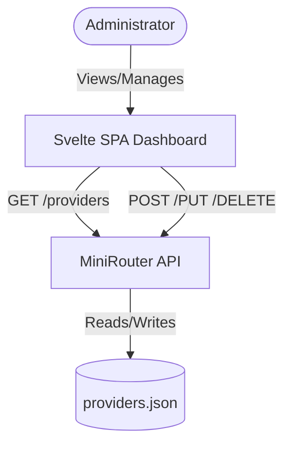

# Component Architecture

## New Components

### Provider Dashboard List
**Responsibility:** Displaying all configured providers in a data table.
**Integration Points:** Consumes `GET /providers`.
**Key Interfaces:**
- `fetchProviders()`
- `deleteProvider(id)`
**Dependencies:**
- **Existing Components:** Backend `GET /providers` endpoint.
- **New Components:** Data Table Component, Alert Dialog (Delete confirmation).
**Technology Stack:** Svelte 5, Tailwind CSS, Svelte UI Components.

### Provider Form Modal
**Responsibility:** Form for creating and editing providers.
**Integration Points:** Consumes `POST /providers` and `PUT /providers/{id}`.
**Key Interfaces:**
- `saveProvider(data)`
**Dependencies:**
- **Existing Components:** Backend `POST /providers` and `PUT /providers/{id}` endpoints.
- **New Components:** Form, Input, Dialog Components.
**Technology Stack:** Svelte 5, Tailwind CSS.

## Component Interaction Diagram

