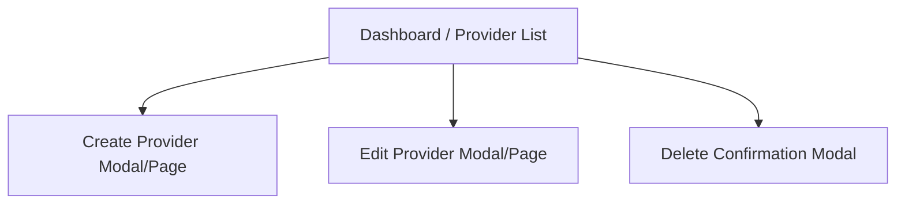

# Information Architecture (IA)

## Site Map / Screen Inventory

## Navigation Structure
**Primary Navigation:** A simple top navigation bar with the MiniRouter logo and a link to the "Providers" dashboard.
**Secondary Navigation:** In-page actions like the "Add New Provider" button and per-row actions (Edit/Delete).
**Breadcrumb Strategy:** Not required due to the flat hierarchy (single-page dashboard).
