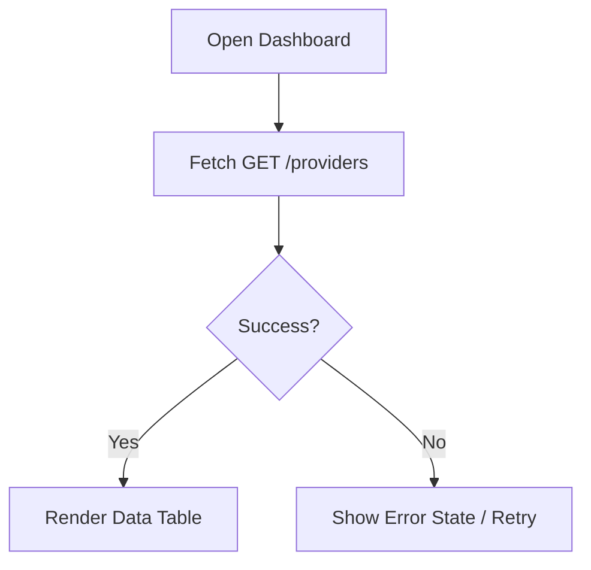
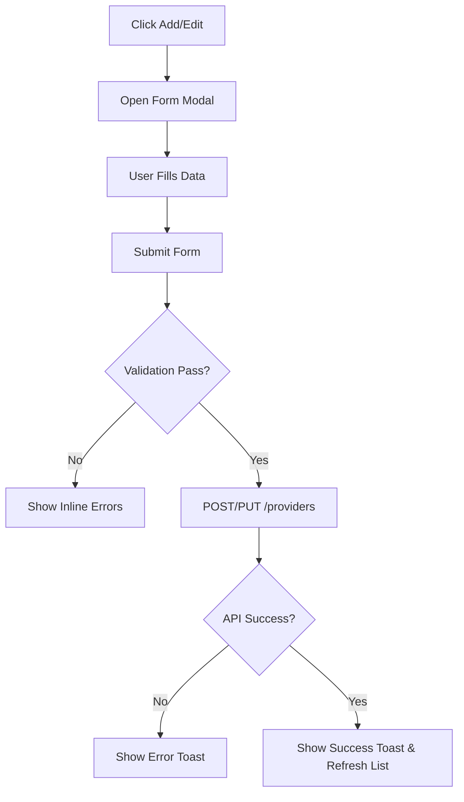

# User Flows

## Flow: View Providers
**User Goal:** See all active LLM routing targets.
**Entry Points:** Loading the SPA index page.
**Success Criteria:** Table populates successfully with provider ID, base URL, and supported models.

- **Edge Cases & Error Handling:**
  - Network error: Show a generic "Unable to reach MiniRouter API" message with a retry button.
  - Empty state: If no providers exist, show an empty state illustration with a "Create your first provider" call to action.

## Flow: Add / Edit Provider
**User Goal:** Add a new LLM provider or update an existing one.
**Entry Points:** "Add Provider" button on dashboard, or "Edit" button on a provider row.
**Success Criteria:** Form is validated, API request succeeds, and the list is refreshed.

- **Edge Cases & Error Handling:**
  - Required fields missing: Prevent submission, highlight fields in red.
  - API Key handling: Mask input by default, provide a "toggle visibility" icon.

## Flow: Delete Provider
**User Goal:** Remove an obsolete provider.
**Entry Points:** "Delete" button on a provider row.
**Success Criteria:** User confirms intent, API deletes provider, row is removed from table.
- **Edge Cases & Error Handling:**
  - Accidental click: Handled by a required confirmation modal (e.g., "Are you sure you want to delete 'OpenAI'?").
