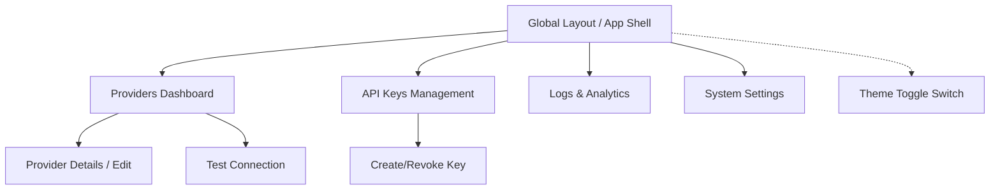
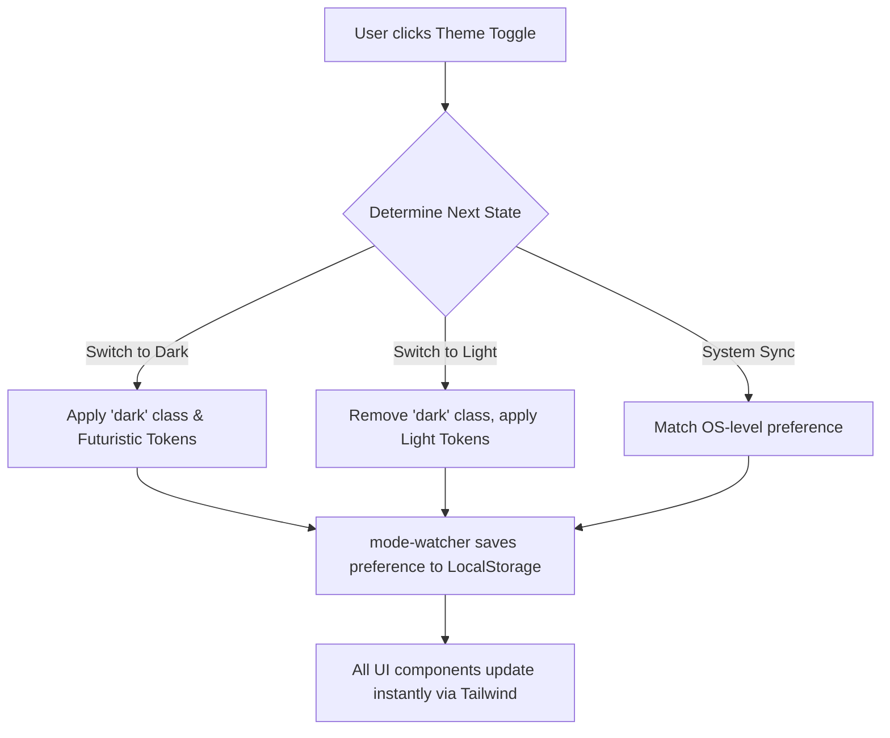

# MininRouter UI/UX Specification

## 1. Introduction
This document defines the user experience goals, information architecture, user flows, and visual design specifications for MininRouter's user interface. It serves as the foundation for visual design and frontend development, ensuring a cohesive and user-centered experience as we transition to a modern, futuristic dark mode.

### Overall UX Goals & Principles

**Target User Personas**
*   **Power User / Analyst:** Needs to monitor LLM analytics and API providers rapidly; requires high data legibility in dark mode to prevent eye strain during long sessions.
*   **System Administrator:** Manages API keys, providers, and configurations; requires clear, unambiguous visual feedback for configuration states and destructive actions.

**Usability Goals**
*   **Aesthetic Appeal:** The interface feels modern, sleek, and futuristic, elevating the perceived value of the product without compromising on rendering speed.
*   **Data Density Legibility:** Complex tables (like model circuit status and routing logs) are easily scannable in high-contrast dark mode.
*   **Theme Seamlessness:** The transition into the futuristic dark mode is instantaneous and flicker-free.

**Design Principles**
1.  **Contrast over Chrome:** Rely on high-contrast background layers rather than heavy borders to separate content areas.
2.  **Glowing Accents:** Use subtle neon glows or vivid accent colors exclusively to denote interactive elements or active states.
3.  **Atomic Consistency:** Adhere strictly to the existing `bits-ui` accessibility primitives while changing only the visual "skin".
4.  **Content-First Legibility:** Futuristic aesthetics must never sacrifice the readability of crucial data.

---

## 2. Information Architecture (IA)

We are maintaining the existing Information Architecture to ensure routing stability, while integrating the new theme toggle into the primary navigation.

### Site Map / Screen Inventory

### Navigation Structure
*   **Primary Navigation:** Persistent main navigation granting access to the core modules. The newly introduced **Global Theme Toggle** is prominently placed here.
*   **Secondary Navigation:** In-page tabs or sub-menus within specific complex views.
*   **Breadcrumb Strategy:** Minimal breadcrumbs are required as the application architecture is relatively flat.

---

## 3. User Flows

### Flow: Theme Toggling & Persistence

**User Goal:** Instantly switch the application interface into the futuristic dark mode (or back to light mode) and have this preference remembered.
**Entry Points:** The persistent theme toggle button located in the global navigation shell.
**Success Criteria:** The visual theme updates instantly without requiring a page reload. The chosen theme persists across browser sessions.

**Edge Cases & Error Handling:**
*   **LocalStorage Blocked:** The application will gracefully fall back to reading the OS-level system preference.
*   **Flash of Unstyled Content (FOUC):** `mode-watcher` handles injecting a blocking script in the `<head>` to apply the theme before Svelte hydrates.

---

## 4. Wireframes & Mockups

Because this enhancement focuses strictly on visual styling (a re-skin), we will adopt a "design in the browser" approach using Tailwind CSS.

### Key Screen Layouts
*   **Global App Shell:** Needs the new Theme Toggle Switch (Sun/Moon/Monitor icon). Clicking the toggle instantly rotates the active theme.
*   **Providers Dashboard & Logs Analytics:** The primary focus is ensuring that alternating row colors, hover states, and colored status badges meet accessibility contrast ratios against the new dark backgrounds.

---

## 5. Component Library / Design System

**Design System Approach:** 
We will strictly maintain the existing component architecture using `bits-ui`. To apply the new futuristic theme, we will adopt a hybrid styling approach:
1.  **Tailwind for Structure:** Continue using Tailwind for layout, grids, spacing, and typography to avoid a costly rewrite.
2.  **Centralized CSS for Aesthetics:** Complex futuristic effects (like neon glows and specific border treatments) will be abstracted into centralized CSS classes within `app.css` (e.g., `.btn-futuristic`) to avoid massive HTML bloat.
3.  **Performance First:** Explicitly reject heavy "glassmorphism" in favor of solid, high-contrast dark colors to guarantee smooth rendering performance in data-heavy views.

---

## 6. Branding & Style Guide

### Color Palette

| Color Type | Hex Code (Tailwind Eqv) | Usage |
| :--- | :--- | :--- |
| **Primary Base** | `#020617` (Slate 950) | Deep space background for the main application shell |
| **Surface** | `#0f172a` (Slate 900) | Elevated cards, modals, and table row backgrounds |
| **Accent / Action** | `#06b6d4` (Cyan 500) | Primary buttons, active tabs, glowing focus rings |
| **Success** | `#22c55e` (Green 500) | Provider "Active" badges, successful test connections |
| **Error / Alert** | `#ef4444` (Red 500) | Circuit breaker triggered, delete buttons |
| **Text Primary** | `#f8fafc` (Slate 50) | High-contrast main body text and headings |
| **Text Muted** | `#94a3b8` (Slate 400) | Secondary text, table headers, inactive states |

### Typography
*   **Primary Font:** `Inter` (or system-ui sans-serif). Chosen for maximum legibility in dense data tables.
*   **Monospace Font:** `JetBrains Mono` (or `Fira Code`). Essential for rendering routing logs, JSON payloads, and API keys beautifully and clearly, enhancing the "developer/hacker" aesthetic.

---

## 7. Accessibility Requirements

**Compliance Target:** WCAG 2.1 AA Minimum

**Key Requirements:**
*   **Color Contrast:** All body text against the dark backgrounds naturally exceeds the 4.5:1 ratio requirement. The Neon Cyan (`#06b6d4`) must maintain a minimum 3:1 contrast ratio against the dark background.
*   **Focus Indicators:** Custom glowing focus rings (e.g., `ring-2 ring-cyan-500 ring-offset-2 ring-offset-slate-950`) must be applied to all interactive elements to clearly indicate keyboard focus.
*   **Interaction:** We retain `bits-ui`'s robust ARIA and keyboard support. Our styling updates must simply not break or hide these existing states.

---

## 8. Responsiveness Strategy

| Breakpoint | Min Width | Target Devices |
| :--- | :--- | :--- |
| **Mobile** | `0px` (Default) | Smartphones (Portrait/Landscape) |
| **Tablet** | `768px` (`md`) | iPads, small tablets |
| **Desktop** | `1024px` (`lg`) | Laptops, desktop monitors |

**Adaptation Patterns:**
*   **Layout Changes:** Standard responsive reflow. Complex multi-column layouts stack vertically on mobile.
*   **Navigation Changes:** Global navigation collapses into a hamburger menu. The Theme Toggle must remain easily accessible.
*   **Interaction Changes:** Hover-specific glows are wrapped in `@media (hover: hover)` to ensure they only activate on devices with a physical mouse pointer, preventing touch-device sticking.

---

## 9. Animation & Micro-interactions

**Motion Principles:**
1.  **Snappy & Purposeful:** Motion provides feedback, not decoration.
2.  **Digital Easing:** Fast `ease-out` curves over slow, bouncy spring animations.
3.  **Accessibility:** Respect OS-level `prefers-reduced-motion`.

**Key Animations:**
*   **Theme Switch (Light to Dark):** Instant (`0ms`). Avoid animating the global background color.
*   **Interactive Glows:** Fast fade-in/fade-out (`150ms ease-out`).
*   **Modal / Dialog Entry:** Quick snap into place (`200ms ease-out`).

---

## 10. Performance Considerations

### Performance Goals
*   **Page Load:** < 1.5s
*   **Interaction Response:** < 100ms
*   **Animation FPS:** 60fps

### Design Strategies
*   **Avoid Expensive CSS:** We explicitly drop heavy `backdrop-blur` for solid dark colors to maintain performance in data-dense views.
*   **Tailwind Optimization:** Rely on Tailwind's compiler to strip unused CSS, keeping the stylesheet extremely small.

---

## 11. Next Steps

### Immediate Actions
1. Provide this UI/UX Specification to the Architect for creating the technical architecture strategy.
2. Prepare to define the exact Tailwind CSS variables required in `tailwind.config.js`.

### Design Handoff Checklist
- [x] All user flows documented
- [x] Component inventory complete
- [x] Accessibility requirements defined
- [x] Responsive strategy clear
- [x] Brand guidelines incorporated
- [x] Performance goals established
